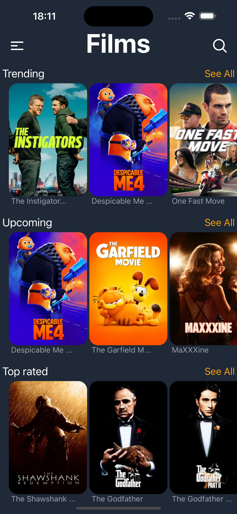
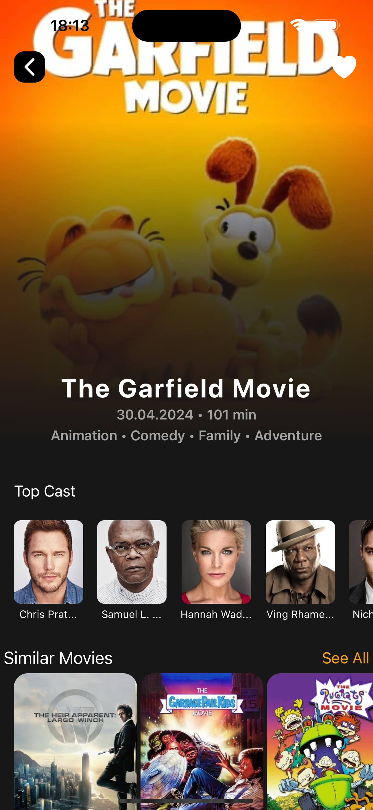
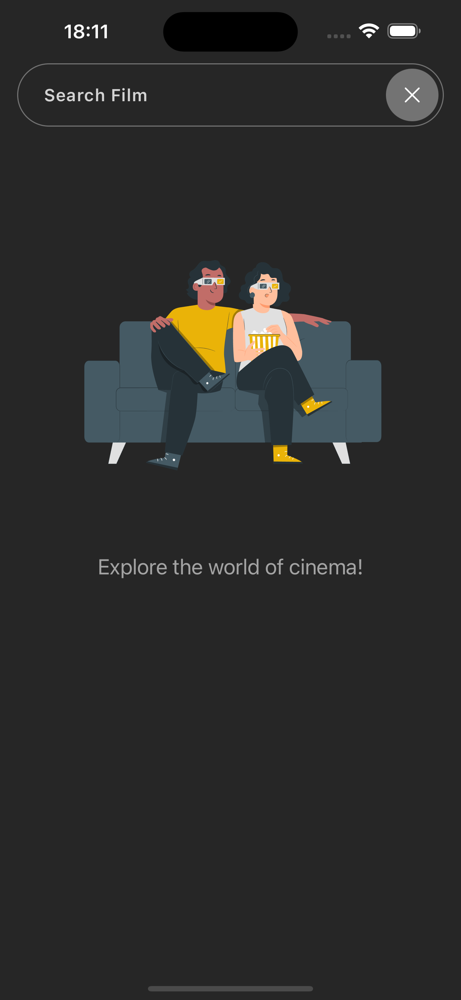
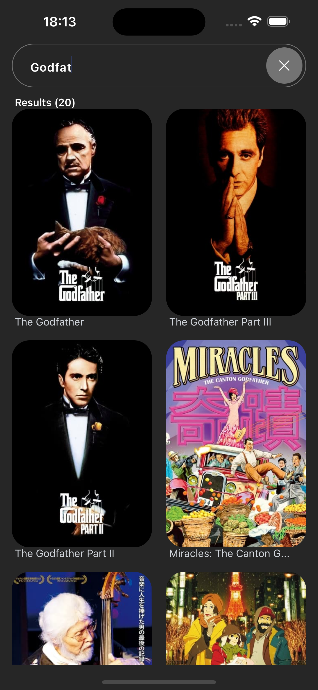
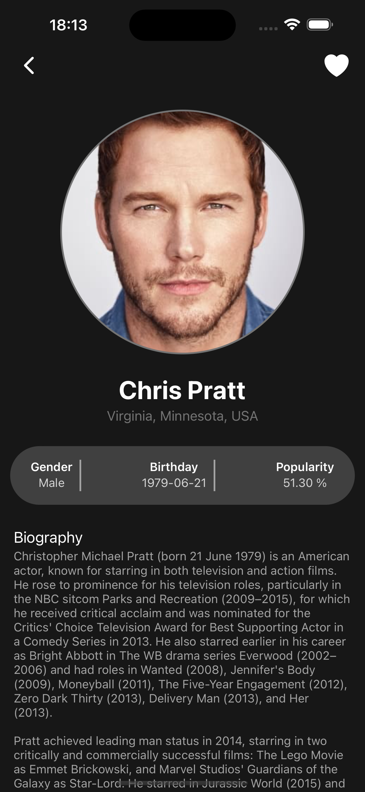
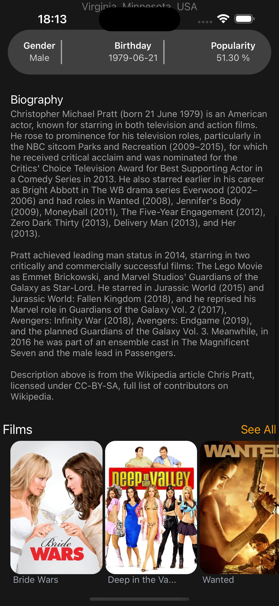

# Films-MobileApp

## Contents
1. [Main Information](#📜-Main-Information)
2. [Stack](#Stack)
3. [Installation and Usage](#Installation-and-Usage)
4. [Examples](#Examples)
    1. [Home screen](#Home-screen)
    2. [Single film](#Single-film)
    3. [Search films](#Search-films)
    4. [Single Person](#Single-Person)

____

## 📜 Main Information

Films-MobileApp is a pet project built using the API from themoviedb.org.

The project consists of:
- **Home Screen.** On the home screen, users can view trending, upcoming, and top-rated films.

- **Single Films.** This screen displays key information about the film, including its year, 
runtime, and genres, as well as details about the actors and similar films.

- **Single Person.** Users can read more information about an actor and see a list of films 
in which the actor appeared.

- **Search Film.** The search bar allows users to find films by title.

____

## Stack

### Client stack

✅ JSX, CSS, Tailwind CSS

✅ JavaScript ES6+

✅ React Native

✅ GraphQL

✅ Apollo GraphQL

✅ Expo

✅ ESlint

### Server stack

✅ axios

✅ express

✅ graphql

✅ apollo-server

✅ apollo-server-express

____

## Installation and Usage

The project consists of two parts: the server and the client.

**Installation:**

* Clone the repository: git clone https://github.com/reyand8/Films-MobileApp.git

**Usage:**

* Client
    - Navigate to the project directory: cd client
    - Install dependencies: npm install
        - Run the project: npm run start
        - Open a browser and navigate to: http://localhost:3000
* Server
    - Navigate to the server directory: cd server
    - Install dependencies: npm install
    - Generate your API key on https://api.themoviedb.org
      and add your key to the config file
    - Run the server: npm run server
    - Server will run on http://localhost:4000/graphql

____

## Examples

### Home screen

____
____

### Single film

____
____

### Search films

____
____

### Single Person

